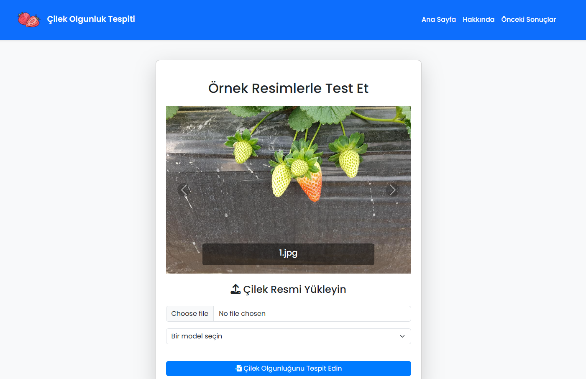
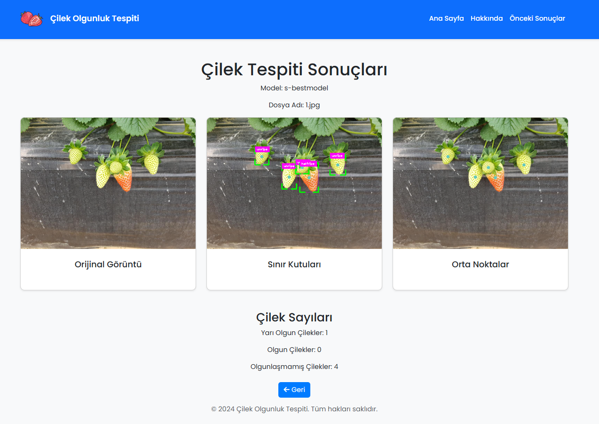
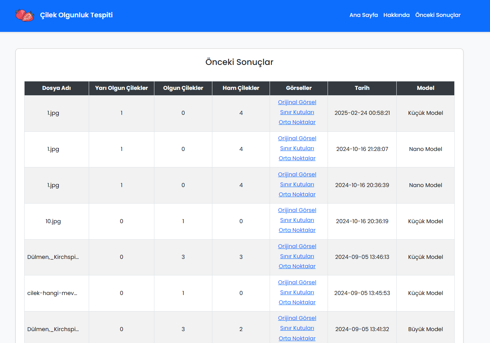

# Strawberry Detection and Classification Web Application

A Flask-based web application that analyzes images of strawberries using YOLO object detection models to identify and classify strawberries by their ripeness state. The application processes uploaded images to detect and count unripe, half-ripe, and ripe strawberries while providing visual feedback through bounding boxes and middle points.

The application leverages multiple pre-trained YOLO models optimized for strawberry detection, offering users the flexibility to choose between different model variants (s, m, l, n, x) for their specific needs. It processes images to a standardized size of 1008x756 pixels and provides both immediate visual results and historical analysis storage, making it ideal for agricultural monitoring and crop management applications.

## Repository Structure
```
.
├── app.py                 # Main Flask application with core detection logic
├── classes.txt           # Classification labels for strawberry types
├── requirements.txt      # Python package dependencies
├── results.json         # Historical analysis results storage
├── static/              # Static assets directory
│   ├── css/            # Stylesheet files
│   ├── js/             # JavaScript files for UI interactions
│   └── models/         # YOLO model files (not shown in tree)
├── templates/           # Flask HTML templates
│   ├── partials/       # Reusable template components
│   └── *.html          # Page templates
└── wsgi.py             # WSGI entry point for production deployment
```

## Usage Instructions
### Prerequisites
- Python 3.x
- CUDA-capable GPU (recommended for optimal performance)
- The following key packages:
  - Flask 3.0.3
  - OpenCV 4.10.0
  - PyTorch 2.3.0
  - Ultralytics 8.2.84
  - Additional dependencies listed in requirements.txt

### Installation
```bash
# Clone the repository
git clone <repository-url>
cd <repository-name>

# Create and activate virtual environment (optional but recommended)
python -m venv venv
source venv/bin/activate  # Linux/Mac
# or
venv\Scripts\activate  # Windows

# Install dependencies
pip install -r requirements.txt
```

### Quick Start
1. Start the application:
```bash
python wsgi.py
```
2. Open a web browser and navigate to `http://localhost:5000`
3. Upload an image of strawberries using the web interface
4. Select a model variant (s, m, l, n, or x)
5. Submit the image for analysis

## Screenshots
### Main Interface

*The main upload interface where users can select images and choose model variants*

### Detection Results

*Example of strawberry detection with bounding boxes showing classification results*

### Middle Points Visualization

*Visualization of detected strawberry centers with classification counts on a table*

### More Detailed Examples
#### Using Different Models
```python
# Example of model selection and analysis
from app import detect_strawberies

# Available models
models = {
    'l-bestmodel': 'static/models/l-best.pt',
    'm-bestmodel': 'static/models/m-best.pt',
    'n-bestmodel': 'static/models/n-best.pt',
    'x-bestmodel': 'static/models/x-best.pt',
    's-bestmodel': 'static/models/s-best.pt',
}

# Analyze image with specific model
detections, counts = detect_strawberies('path/to/image.jpg', models['s-bestmodel'])
print(f"Detected: {counts}")
```

### Troubleshooting
#### Common Issues
1. Model Loading Errors
   - Error: "No such file or directory: 'static/models/x-best.pt'"
   - Solution: Ensure model files are present in the static/models directory
   - Debug: `ls static/models/` to verify model files

2. Image Processing Errors
   - Error: "Cannot process image"
   - Solution: Verify image format and size
   - Debug: Enable verbose logging in Flask
   ```python
   app.logger.setLevel(logging.DEBUG)
   ```

3. Performance Issues
   - Monitor GPU memory usage: `nvidia-smi`
   - Reduce image size if processing is slow
   - Consider using lighter models (s-best or m-best) for faster processing

## Data Flow
The application processes images through a pipeline that handles upload, detection, and result storage.

```ascii
[Upload] -> [Resize/Format] -> [YOLO Detection] -> [Classification]
     |                                                    |
     v                                                    v
[Image Storage] <- [Result Processing] <- [Count/Annotate]
```

Key component interactions:
1. Web interface accepts image uploads and model selection
2. Images are standardized to 1008x756 pixels in JPG format
3. Selected YOLO model processes image for strawberry detection
4. Detection results are processed to identify ripeness states
5. Bounding boxes and middle points are drawn on the image
6. Results are stored in results.json for historical tracking
7. Processed images and statistics are displayed to the user